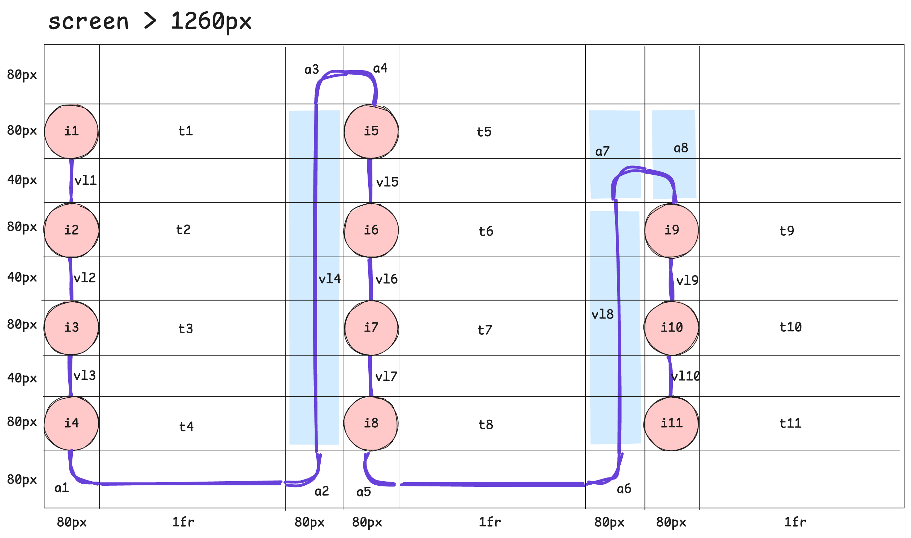
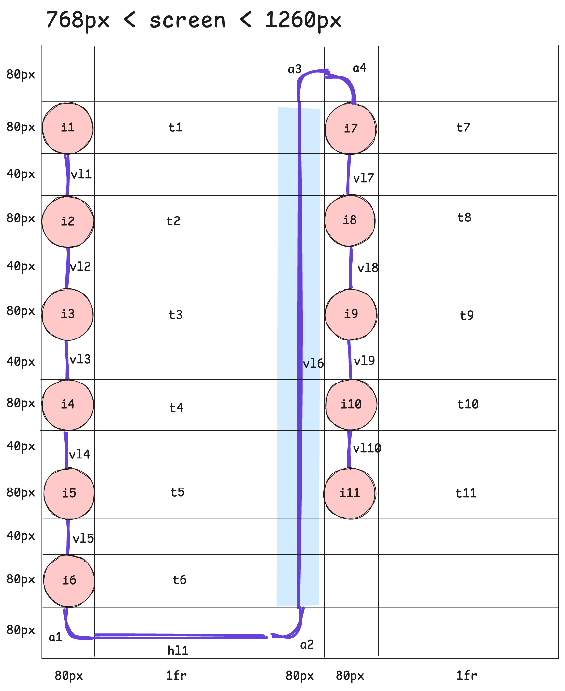
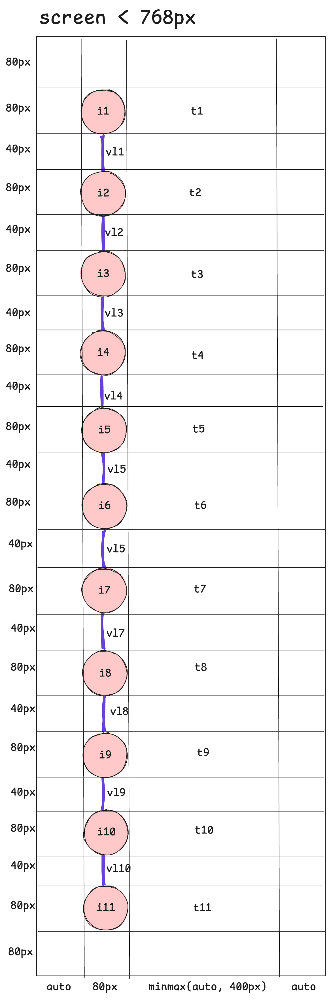

In this folder is the diagram used to design the checklist graphic layout. 
It is the drawn out version of the `grid-template-areas` properties for the
three screen breakpoints. Reference it when adding or removing the number
of steps, and consider updating the diagram file and this documentation when
making

**Notes**:
- all measurements of 80px are defined in the code using the --icon-size CSS variable
- all measurements of 40px are defined in the code using the --gutter-height CSS variable

## Large Screen:

## Medium Screen:

## Small Screen:
